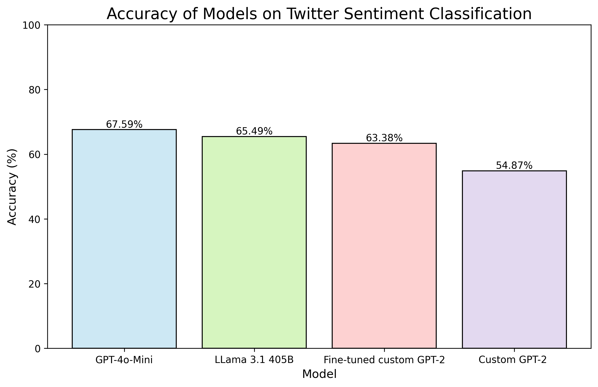

# GPT2-Custom

## Overview

This repository documents my journey in training a 124-million-parameter GPT model from scratch, detailing the costs and methodologies involved. Later, I explore fine-tuning this model using synthetic data generated from LLama 405B. This project is primarily a learning exercise, drawing inspiration and techniques from Andrej Karpathy's YouTube series on model training.

Additionally, I provide insights into the dataset used for fine-tuning, performance evaluations, and key takeaways from the process.

---

## Project Goals
- Train a GPT-2 style model from scratch with 124M parameters
- Document the cost and computational resources required
- Fine-tune the trained model using synthetic data generated by LLama 405B
- Evaluate the model's performance and compare it to pre-trained alternatives
- Share learnings from the process

---

## Installation

To get started, clone this repository and set up the necessary environment:

```bash
# Clone the repository
git clone https://github.com/yourusername/GPT2-custom.git
cd GPT2-custom

# Create a virtual environment (optional but recommended)
python -m venv venv
source venv/bin/activate  # On Windows use `venv\Scripts\activate`

# Install dependencies
pip install -r requirements.txt
```

Make sure you have access to a GPU with CUDA support for optimal performance.

---

## Model Training

### Step 1: Data Preparation
1. Download and preprocess the datasets:
   - The **FineWeb** dataset for training
   - The **HellaSwag** dataset for testing
2. Run the scripts to obtain the datasets:
   ```bash
   python fineweb.py  # Downloads and prepares FineWeb dataset
   python hellaswag.py  # Downloads and prepares HellaSwag dataset
   ```
3. Convert the dataset into a format suitable for training.

### Step 2: Training the Model
To train the model from scratch, run:
```bash
python train.py --config config/train_config.yaml
```
**Training Parameters:**
- Model size: 124M parameters
- Batch size: 0.5 million tokens
- Learning rate: starts at 6e-4 but decays 10% after 768 warmup steps 
- Training time: 2.5 hours to upload data, train model, and download results.


### Step 3: Fine-Tuning with Synthetic Data
After initial training, we fine-tune the model using synthetic data from LLama 405B. Run:
```bash
python finetune.py --config config/finetune_config.yaml
```

The fine-tuning process leverages model distillation techniques, which are detailed in the notebook:
```bash
model_distillation.ipynb


## Model Evaluation
To evaluate the trained model, use:
```bash
python evaluate.py --model_path models/gpt2-custom
```
Evaluation metrics include:
- Perplexity score
- Accuracy on benchmark datasets (HellaSwag)
- Comparison with existing pre-trained models



---

## Cost Analysis
One of the key aspects of this project is understanding the computational cost involved.

## Cost Analysis

One of the key aspects of this project is understanding the computational cost involved.

### Cost Breakdown:
| Expense | Cost (USD) |
|---------|------------|
| **Lambda Labs GPUs (8 × A100, 2.5 hours @ $20.50/hr)** | $51.25 |
| **Hugging Face Fine-Tuning** | $2.00 |
| **Total** | **$53.25** |


---

### **Side Note: Key Time-Saving Techniques for 16,000 → 185,000 Tokens/Sec on a Single A100**

- **Lowering Precision**: Switching from `float32` to `float16` significantly reduced memory bottlenecks.
- **Leveraging TF32**: Using TensorFloat32 (TF32) led to a free 3x speed-up.
- **Utilizing Flash Attention**: Improved attention mechanism handling memory efficiently.
- **Optimizing Vocabulary Size**: Adjusting the vocab from `50257` to `50304` gave an easy 4% improvement.
- **Enabling `torch.compile`**: Reduced Python overhead and improved kernel fusion efficiency.
- **Implementing Distributed Training**: Leveraging `torchrun` and `DistributedDataParallel (DDP)` allowed multi-GPU utilization, boosting throughput drastically.


## Lessons Learned
Throughout this process, I gained insights into:
- The importance of high-quality data for training
- Optimizing hyperparameters for better performance
- The cost-benefit tradeoff of training from scratch vs. fine-tuning
- Challenges in synthetic data generation and usage

---

## Future Work
- Experiment with larger models (e.g., 345M, 774M parameters)
- Improve fine-tuning strategies with real-world datasets
- Optimize inference speed and deployment
- Explore reinforcement learning for better responses

---

## Contributions
This project is an independent learning exercise. However, contributions, suggestions, and collaborations are welcome. Feel free to open issues or submit pull requests.

---

## References
- Andrej Karpathy's YouTube series on training language models
- OpenAI's research on GPT architectures
- Hugging Face and PyTorch documentation

---

## License
This project is released under the MIT License. See [LICENSE](LICENSE) for details.

